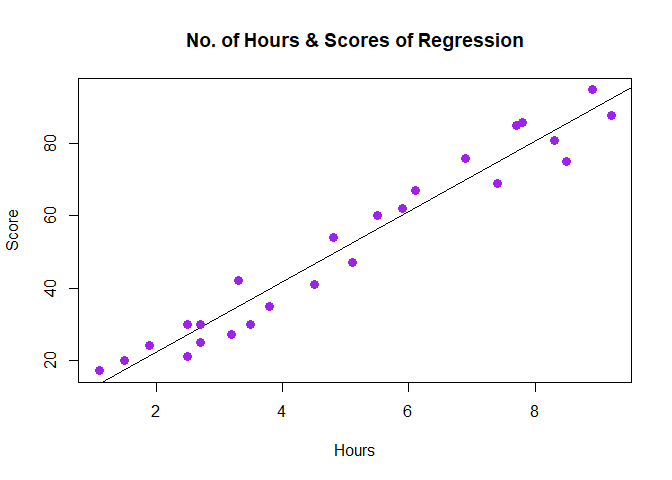

Task 1 using student dataset
================

### Read the dataset from the csv file

``` r
task1 <- read.csv("Task1.csv")
print(task1)
```

    ##    Hours Scores
    ## 1    2.5     21
    ## 2    5.1     47
    ## 3    3.2     27
    ## 4    8.5     75
    ## 5    3.5     30
    ## 6    1.5     20
    ## 7    9.2     88
    ## 8    5.5     60
    ## 9    8.3     81
    ## 10   2.7     25
    ## 11   7.7     85
    ## 12   5.9     62
    ## 13   4.5     41
    ## 14   3.3     42
    ## 15   1.1     17
    ## 16   8.9     95
    ## 17   2.5     30
    ## 18   1.9     24
    ## 19   6.1     67
    ## 20   7.4     69
    ## 21   2.7     30
    ## 22   4.8     54
    ## 23   3.8     35
    ## 24   6.9     76
    ## 25   7.8     86

### Summary of the given dataset

``` r
summary(task1)
```

    ##      Hours           Scores     
    ##  Min.   :1.100   Min.   :17.00  
    ##  1st Qu.:2.700   1st Qu.:30.00  
    ##  Median :4.800   Median :47.00  
    ##  Mean   :5.012   Mean   :51.48  
    ##  3rd Qu.:7.400   3rd Qu.:75.00  
    ##  Max.   :9.200   Max.   :95.00

### Allocating variables to the dataset

``` r
hour<-task1$Hours
score<-task1$Scores
```

``` r
print(hour)
```

    ##  [1] 2.5 5.1 3.2 8.5 3.5 1.5 9.2 5.5 8.3 2.7 7.7 5.9 4.5 3.3 1.1 8.9 2.5 1.9 6.1
    ## [20] 7.4 2.7 4.8 3.8 6.9 7.8

``` r
print(score)
```

    ##  [1] 21 47 27 75 30 20 88 60 81 25 85 62 41 42 17 95 30 24 67 69 30 54 35 76 86

### Creating linear Regression Model of the dataset

``` r
r1<- lm(score~hour)
```

``` r
print(r1)
```

    ## 
    ## Call:
    ## lm(formula = score ~ hour)
    ## 
    ## Coefficients:
    ## (Intercept)         hour  
    ##       2.484        9.776

### Graphical Representation of Linear Regression Model

``` r
plot(hour,score,col = "purple",main = "No. of Hours & Scores of Regression", abline(r1),cex = 1.3,pch = 16,xlab = "Hours",ylab = "Score")
```

<!-- -->

### Predicting score of a person who studies 9.25hrs/day

``` r
pred<-data.frame(hour=9.25)
result<- predict(r1,pred)
print(result)
```

    ##        1 
    ## 92.90985
