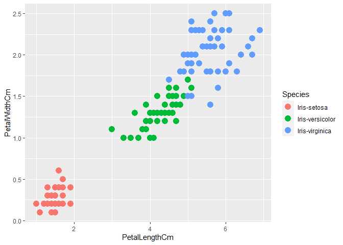
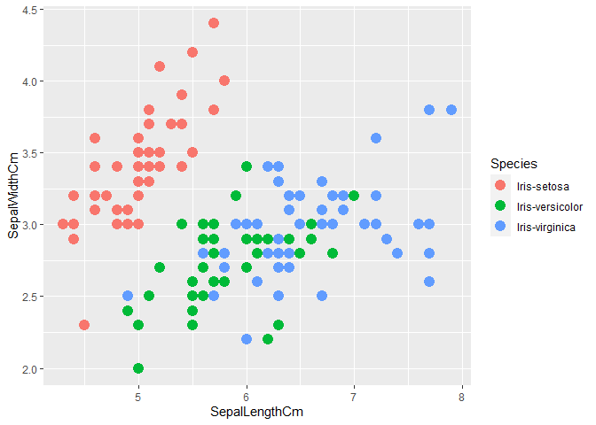
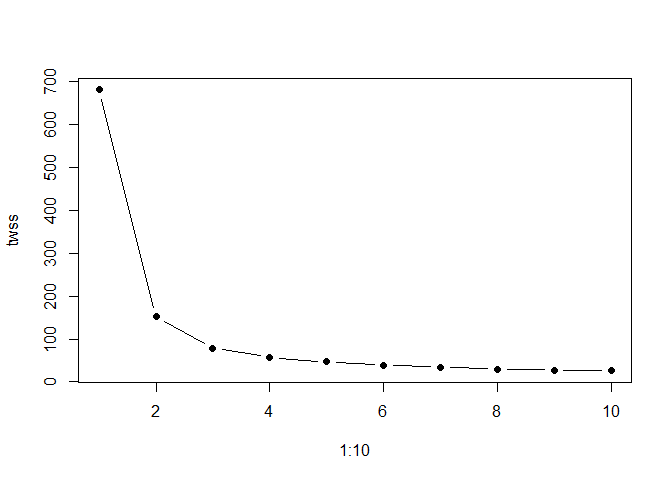
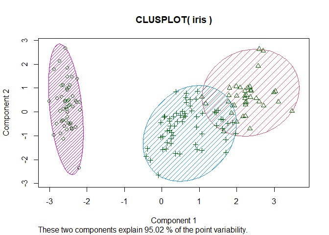

Task 2 Iris dataset
================

### importing ***ggplot & cluster*** library

``` r
library(ggplot2)
library(cluster)
```

### Read the dataset from the csv file

``` r
task2 <- read.csv("iris.csv")
print(task2)
```

    ##      Id SepalLengthCm SepalWidthCm PetalLengthCm PetalWidthCm         Species
    ## 1     1           5.1          3.5           1.4          0.2     Iris-setosa
    ## 2     2           4.9          3.0           1.4          0.2     Iris-setosa
    ## 3     3           4.7          3.2           1.3          0.2     Iris-setosa
    ## 4     4           4.6          3.1           1.5          0.2     Iris-setosa
    ## 5     5           5.0          3.6           1.4          0.2     Iris-setosa
    ## 6     6           5.4          3.9           1.7          0.4     Iris-setosa
    ## 7     7           4.6          3.4           1.4          0.3     Iris-setosa
    ## 8     8           5.0          3.4           1.5          0.2     Iris-setosa
    ## 9     9           4.4          2.9           1.4          0.2     Iris-setosa
    ## 10   10           4.9          3.1           1.5          0.1     Iris-setosa
    ## 11   11           5.4          3.7           1.5          0.2     Iris-setosa
    ## 12   12           4.8          3.4           1.6          0.2     Iris-setosa
    ## 13   13           4.8          3.0           1.4          0.1     Iris-setosa
    ## 14   14           4.3          3.0           1.1          0.1     Iris-setosa
    ## 15   15           5.8          4.0           1.2          0.2     Iris-setosa
    ## 16   16           5.7          4.4           1.5          0.4     Iris-setosa
    ## 17   17           5.4          3.9           1.3          0.4     Iris-setosa
    ## 18   18           5.1          3.5           1.4          0.3     Iris-setosa
    ## 19   19           5.7          3.8           1.7          0.3     Iris-setosa
    ## 20   20           5.1          3.8           1.5          0.3     Iris-setosa
    ## 21   21           5.4          3.4           1.7          0.2     Iris-setosa
    ## 22   22           5.1          3.7           1.5          0.4     Iris-setosa
    ## 23   23           4.6          3.6           1.0          0.2     Iris-setosa
    ## 24   24           5.1          3.3           1.7          0.5     Iris-setosa
    ## 25   25           4.8          3.4           1.9          0.2     Iris-setosa
    ## 26   26           5.0          3.0           1.6          0.2     Iris-setosa
    ## 27   27           5.0          3.4           1.6          0.4     Iris-setosa
    ## 28   28           5.2          3.5           1.5          0.2     Iris-setosa
    ## 29   29           5.2          3.4           1.4          0.2     Iris-setosa
    ## 30   30           4.7          3.2           1.6          0.2     Iris-setosa
    ## 31   31           4.8          3.1           1.6          0.2     Iris-setosa
    ## 32   32           5.4          3.4           1.5          0.4     Iris-setosa
    ## 33   33           5.2          4.1           1.5          0.1     Iris-setosa
    ## 34   34           5.5          4.2           1.4          0.2     Iris-setosa
    ## 35   35           4.9          3.1           1.5          0.1     Iris-setosa
    ## 36   36           5.0          3.2           1.2          0.2     Iris-setosa
    ## 37   37           5.5          3.5           1.3          0.2     Iris-setosa
    ## 38   38           4.9          3.1           1.5          0.1     Iris-setosa
    ## 39   39           4.4          3.0           1.3          0.2     Iris-setosa
    ## 40   40           5.1          3.4           1.5          0.2     Iris-setosa
    ## 41   41           5.0          3.5           1.3          0.3     Iris-setosa
    ## 42   42           4.5          2.3           1.3          0.3     Iris-setosa
    ## 43   43           4.4          3.2           1.3          0.2     Iris-setosa
    ## 44   44           5.0          3.5           1.6          0.6     Iris-setosa
    ## 45   45           5.1          3.8           1.9          0.4     Iris-setosa
    ## 46   46           4.8          3.0           1.4          0.3     Iris-setosa
    ## 47   47           5.1          3.8           1.6          0.2     Iris-setosa
    ## 48   48           4.6          3.2           1.4          0.2     Iris-setosa
    ## 49   49           5.3          3.7           1.5          0.2     Iris-setosa
    ## 50   50           5.0          3.3           1.4          0.2     Iris-setosa
    ## 51   51           7.0          3.2           4.7          1.4 Iris-versicolor
    ## 52   52           6.4          3.2           4.5          1.5 Iris-versicolor
    ## 53   53           6.9          3.1           4.9          1.5 Iris-versicolor
    ## 54   54           5.5          2.3           4.0          1.3 Iris-versicolor
    ## 55   55           6.5          2.8           4.6          1.5 Iris-versicolor
    ## 56   56           5.7          2.8           4.5          1.3 Iris-versicolor
    ## 57   57           6.3          3.3           4.7          1.6 Iris-versicolor
    ## 58   58           4.9          2.4           3.3          1.0 Iris-versicolor
    ## 59   59           6.6          2.9           4.6          1.3 Iris-versicolor
    ## 60   60           5.2          2.7           3.9          1.4 Iris-versicolor
    ## 61   61           5.0          2.0           3.5          1.0 Iris-versicolor
    ## 62   62           5.9          3.0           4.2          1.5 Iris-versicolor
    ## 63   63           6.0          2.2           4.0          1.0 Iris-versicolor
    ## 64   64           6.1          2.9           4.7          1.4 Iris-versicolor
    ## 65   65           5.6          2.9           3.6          1.3 Iris-versicolor
    ## 66   66           6.7          3.1           4.4          1.4 Iris-versicolor
    ## 67   67           5.6          3.0           4.5          1.5 Iris-versicolor
    ## 68   68           5.8          2.7           4.1          1.0 Iris-versicolor
    ## 69   69           6.2          2.2           4.5          1.5 Iris-versicolor
    ## 70   70           5.6          2.5           3.9          1.1 Iris-versicolor
    ## 71   71           5.9          3.2           4.8          1.8 Iris-versicolor
    ## 72   72           6.1          2.8           4.0          1.3 Iris-versicolor
    ## 73   73           6.3          2.5           4.9          1.5 Iris-versicolor
    ## 74   74           6.1          2.8           4.7          1.2 Iris-versicolor
    ## 75   75           6.4          2.9           4.3          1.3 Iris-versicolor
    ## 76   76           6.6          3.0           4.4          1.4 Iris-versicolor
    ## 77   77           6.8          2.8           4.8          1.4 Iris-versicolor
    ## 78   78           6.7          3.0           5.0          1.7 Iris-versicolor
    ## 79   79           6.0          2.9           4.5          1.5 Iris-versicolor
    ## 80   80           5.7          2.6           3.5          1.0 Iris-versicolor
    ## 81   81           5.5          2.4           3.8          1.1 Iris-versicolor
    ## 82   82           5.5          2.4           3.7          1.0 Iris-versicolor
    ## 83   83           5.8          2.7           3.9          1.2 Iris-versicolor
    ## 84   84           6.0          2.7           5.1          1.6 Iris-versicolor
    ## 85   85           5.4          3.0           4.5          1.5 Iris-versicolor
    ## 86   86           6.0          3.4           4.5          1.6 Iris-versicolor
    ## 87   87           6.7          3.1           4.7          1.5 Iris-versicolor
    ## 88   88           6.3          2.3           4.4          1.3 Iris-versicolor
    ## 89   89           5.6          3.0           4.1          1.3 Iris-versicolor
    ## 90   90           5.5          2.5           4.0          1.3 Iris-versicolor
    ## 91   91           5.5          2.6           4.4          1.2 Iris-versicolor
    ## 92   92           6.1          3.0           4.6          1.4 Iris-versicolor
    ## 93   93           5.8          2.6           4.0          1.2 Iris-versicolor
    ## 94   94           5.0          2.3           3.3          1.0 Iris-versicolor
    ## 95   95           5.6          2.7           4.2          1.3 Iris-versicolor
    ## 96   96           5.7          3.0           4.2          1.2 Iris-versicolor
    ## 97   97           5.7          2.9           4.2          1.3 Iris-versicolor
    ## 98   98           6.2          2.9           4.3          1.3 Iris-versicolor
    ## 99   99           5.1          2.5           3.0          1.1 Iris-versicolor
    ## 100 100           5.7          2.8           4.1          1.3 Iris-versicolor
    ## 101 101           6.3          3.3           6.0          2.5  Iris-virginica
    ## 102 102           5.8          2.7           5.1          1.9  Iris-virginica
    ## 103 103           7.1          3.0           5.9          2.1  Iris-virginica
    ## 104 104           6.3          2.9           5.6          1.8  Iris-virginica
    ## 105 105           6.5          3.0           5.8          2.2  Iris-virginica
    ## 106 106           7.6          3.0           6.6          2.1  Iris-virginica
    ## 107 107           4.9          2.5           4.5          1.7  Iris-virginica
    ## 108 108           7.3          2.9           6.3          1.8  Iris-virginica
    ## 109 109           6.7          2.5           5.8          1.8  Iris-virginica
    ## 110 110           7.2          3.6           6.1          2.5  Iris-virginica
    ## 111 111           6.5          3.2           5.1          2.0  Iris-virginica
    ## 112 112           6.4          2.7           5.3          1.9  Iris-virginica
    ## 113 113           6.8          3.0           5.5          2.1  Iris-virginica
    ## 114 114           5.7          2.5           5.0          2.0  Iris-virginica
    ## 115 115           5.8          2.8           5.1          2.4  Iris-virginica
    ## 116 116           6.4          3.2           5.3          2.3  Iris-virginica
    ## 117 117           6.5          3.0           5.5          1.8  Iris-virginica
    ## 118 118           7.7          3.8           6.7          2.2  Iris-virginica
    ## 119 119           7.7          2.6           6.9          2.3  Iris-virginica
    ## 120 120           6.0          2.2           5.0          1.5  Iris-virginica
    ## 121 121           6.9          3.2           5.7          2.3  Iris-virginica
    ## 122 122           5.6          2.8           4.9          2.0  Iris-virginica
    ## 123 123           7.7          2.8           6.7          2.0  Iris-virginica
    ## 124 124           6.3          2.7           4.9          1.8  Iris-virginica
    ## 125 125           6.7          3.3           5.7          2.1  Iris-virginica
    ## 126 126           7.2          3.2           6.0          1.8  Iris-virginica
    ## 127 127           6.2          2.8           4.8          1.8  Iris-virginica
    ## 128 128           6.1          3.0           4.9          1.8  Iris-virginica
    ## 129 129           6.4          2.8           5.6          2.1  Iris-virginica
    ## 130 130           7.2          3.0           5.8          1.6  Iris-virginica
    ## 131 131           7.4          2.8           6.1          1.9  Iris-virginica
    ## 132 132           7.9          3.8           6.4          2.0  Iris-virginica
    ## 133 133           6.4          2.8           5.6          2.2  Iris-virginica
    ## 134 134           6.3          2.8           5.1          1.5  Iris-virginica
    ## 135 135           6.1          2.6           5.6          1.4  Iris-virginica
    ## 136 136           7.7          3.0           6.1          2.3  Iris-virginica
    ## 137 137           6.3          3.4           5.6          2.4  Iris-virginica
    ## 138 138           6.4          3.1           5.5          1.8  Iris-virginica
    ## 139 139           6.0          3.0           4.8          1.8  Iris-virginica
    ## 140 140           6.9          3.1           5.4          2.1  Iris-virginica
    ## 141 141           6.7          3.1           5.6          2.4  Iris-virginica
    ## 142 142           6.9          3.1           5.1          2.3  Iris-virginica
    ## 143 143           5.8          2.7           5.1          1.9  Iris-virginica
    ## 144 144           6.8          3.2           5.9          2.3  Iris-virginica
    ## 145 145           6.7          3.3           5.7          2.5  Iris-virginica
    ## 146 146           6.7          3.0           5.2          2.3  Iris-virginica
    ## 147 147           6.3          2.5           5.0          1.9  Iris-virginica
    ## 148 148           6.5          3.0           5.2          2.0  Iris-virginica
    ## 149 149           6.2          3.4           5.4          2.3  Iris-virginica
    ## 150 150           5.9          3.0           5.1          1.8  Iris-virginica

``` r
library(ggplot2)
```

## Plotting graph between PetalLengthCm and PetalWidthCm

``` r
ggplot(task2, aes(PetalLengthCm, PetalWidthCm)) + geom_point(aes(col=Species), size=4)
```

<!-- -->

## Plotting graph between SepalLengthCm and SepalWidthCm

``` r
ggplot(task2, aes(SepalLengthCm, SepalWidthCm)) + geom_point(aes(col=Species), size=4)
```

<!-- --> \#\#\# Summary
of the given dataset

``` r
summary(task2)
```

    ##        Id         SepalLengthCm    SepalWidthCm   PetalLengthCm  
    ##  Min.   :  1.00   Min.   :4.300   Min.   :2.000   Min.   :1.000  
    ##  1st Qu.: 38.25   1st Qu.:5.100   1st Qu.:2.800   1st Qu.:1.600  
    ##  Median : 75.50   Median :5.800   Median :3.000   Median :4.350  
    ##  Mean   : 75.50   Mean   :5.843   Mean   :3.054   Mean   :3.759  
    ##  3rd Qu.:112.75   3rd Qu.:6.400   3rd Qu.:3.300   3rd Qu.:5.100  
    ##  Max.   :150.00   Max.   :7.900   Max.   :4.400   Max.   :6.900  
    ##   PetalWidthCm     Species         
    ##  Min.   :0.100   Length:150        
    ##  1st Qu.:0.300   Class :character  
    ##  Median :1.300   Mode  :character  
    ##  Mean   :1.199                     
    ##  3rd Qu.:1.800                     
    ##  Max.   :2.500

``` r
head(task2)
```

    ##   Id SepalLengthCm SepalWidthCm PetalLengthCm PetalWidthCm     Species
    ## 1  1           5.1          3.5           1.4          0.2 Iris-setosa
    ## 2  2           4.9          3.0           1.4          0.2 Iris-setosa
    ## 3  3           4.7          3.2           1.3          0.2 Iris-setosa
    ## 4  4           4.6          3.1           1.5          0.2 Iris-setosa
    ## 5  5           5.0          3.6           1.4          0.2 Iris-setosa
    ## 6  6           5.4          3.9           1.7          0.4 Iris-setosa

### Extracting the features

``` r
k<- c("SepalLengthCm","SepalWidthCm","PetalLengthCm","PetalWidthCm")
df = task2[k]
print(df)
```

    ##     SepalLengthCm SepalWidthCm PetalLengthCm PetalWidthCm
    ## 1             5.1          3.5           1.4          0.2
    ## 2             4.9          3.0           1.4          0.2
    ## 3             4.7          3.2           1.3          0.2
    ## 4             4.6          3.1           1.5          0.2
    ## 5             5.0          3.6           1.4          0.2
    ## 6             5.4          3.9           1.7          0.4
    ## 7             4.6          3.4           1.4          0.3
    ## 8             5.0          3.4           1.5          0.2
    ## 9             4.4          2.9           1.4          0.2
    ## 10            4.9          3.1           1.5          0.1
    ## 11            5.4          3.7           1.5          0.2
    ## 12            4.8          3.4           1.6          0.2
    ## 13            4.8          3.0           1.4          0.1
    ## 14            4.3          3.0           1.1          0.1
    ## 15            5.8          4.0           1.2          0.2
    ## 16            5.7          4.4           1.5          0.4
    ## 17            5.4          3.9           1.3          0.4
    ## 18            5.1          3.5           1.4          0.3
    ## 19            5.7          3.8           1.7          0.3
    ## 20            5.1          3.8           1.5          0.3
    ## 21            5.4          3.4           1.7          0.2
    ## 22            5.1          3.7           1.5          0.4
    ## 23            4.6          3.6           1.0          0.2
    ## 24            5.1          3.3           1.7          0.5
    ## 25            4.8          3.4           1.9          0.2
    ## 26            5.0          3.0           1.6          0.2
    ## 27            5.0          3.4           1.6          0.4
    ## 28            5.2          3.5           1.5          0.2
    ## 29            5.2          3.4           1.4          0.2
    ## 30            4.7          3.2           1.6          0.2
    ## 31            4.8          3.1           1.6          0.2
    ## 32            5.4          3.4           1.5          0.4
    ## 33            5.2          4.1           1.5          0.1
    ## 34            5.5          4.2           1.4          0.2
    ## 35            4.9          3.1           1.5          0.1
    ## 36            5.0          3.2           1.2          0.2
    ## 37            5.5          3.5           1.3          0.2
    ## 38            4.9          3.1           1.5          0.1
    ## 39            4.4          3.0           1.3          0.2
    ## 40            5.1          3.4           1.5          0.2
    ## 41            5.0          3.5           1.3          0.3
    ## 42            4.5          2.3           1.3          0.3
    ## 43            4.4          3.2           1.3          0.2
    ## 44            5.0          3.5           1.6          0.6
    ## 45            5.1          3.8           1.9          0.4
    ## 46            4.8          3.0           1.4          0.3
    ## 47            5.1          3.8           1.6          0.2
    ## 48            4.6          3.2           1.4          0.2
    ## 49            5.3          3.7           1.5          0.2
    ## 50            5.0          3.3           1.4          0.2
    ## 51            7.0          3.2           4.7          1.4
    ## 52            6.4          3.2           4.5          1.5
    ## 53            6.9          3.1           4.9          1.5
    ## 54            5.5          2.3           4.0          1.3
    ## 55            6.5          2.8           4.6          1.5
    ## 56            5.7          2.8           4.5          1.3
    ## 57            6.3          3.3           4.7          1.6
    ## 58            4.9          2.4           3.3          1.0
    ## 59            6.6          2.9           4.6          1.3
    ## 60            5.2          2.7           3.9          1.4
    ## 61            5.0          2.0           3.5          1.0
    ## 62            5.9          3.0           4.2          1.5
    ## 63            6.0          2.2           4.0          1.0
    ## 64            6.1          2.9           4.7          1.4
    ## 65            5.6          2.9           3.6          1.3
    ## 66            6.7          3.1           4.4          1.4
    ## 67            5.6          3.0           4.5          1.5
    ## 68            5.8          2.7           4.1          1.0
    ## 69            6.2          2.2           4.5          1.5
    ## 70            5.6          2.5           3.9          1.1
    ## 71            5.9          3.2           4.8          1.8
    ## 72            6.1          2.8           4.0          1.3
    ## 73            6.3          2.5           4.9          1.5
    ## 74            6.1          2.8           4.7          1.2
    ## 75            6.4          2.9           4.3          1.3
    ## 76            6.6          3.0           4.4          1.4
    ## 77            6.8          2.8           4.8          1.4
    ## 78            6.7          3.0           5.0          1.7
    ## 79            6.0          2.9           4.5          1.5
    ## 80            5.7          2.6           3.5          1.0
    ## 81            5.5          2.4           3.8          1.1
    ## 82            5.5          2.4           3.7          1.0
    ## 83            5.8          2.7           3.9          1.2
    ## 84            6.0          2.7           5.1          1.6
    ## 85            5.4          3.0           4.5          1.5
    ## 86            6.0          3.4           4.5          1.6
    ## 87            6.7          3.1           4.7          1.5
    ## 88            6.3          2.3           4.4          1.3
    ## 89            5.6          3.0           4.1          1.3
    ## 90            5.5          2.5           4.0          1.3
    ## 91            5.5          2.6           4.4          1.2
    ## 92            6.1          3.0           4.6          1.4
    ## 93            5.8          2.6           4.0          1.2
    ## 94            5.0          2.3           3.3          1.0
    ## 95            5.6          2.7           4.2          1.3
    ## 96            5.7          3.0           4.2          1.2
    ## 97            5.7          2.9           4.2          1.3
    ## 98            6.2          2.9           4.3          1.3
    ## 99            5.1          2.5           3.0          1.1
    ## 100           5.7          2.8           4.1          1.3
    ## 101           6.3          3.3           6.0          2.5
    ## 102           5.8          2.7           5.1          1.9
    ## 103           7.1          3.0           5.9          2.1
    ## 104           6.3          2.9           5.6          1.8
    ## 105           6.5          3.0           5.8          2.2
    ## 106           7.6          3.0           6.6          2.1
    ## 107           4.9          2.5           4.5          1.7
    ## 108           7.3          2.9           6.3          1.8
    ## 109           6.7          2.5           5.8          1.8
    ## 110           7.2          3.6           6.1          2.5
    ## 111           6.5          3.2           5.1          2.0
    ## 112           6.4          2.7           5.3          1.9
    ## 113           6.8          3.0           5.5          2.1
    ## 114           5.7          2.5           5.0          2.0
    ## 115           5.8          2.8           5.1          2.4
    ## 116           6.4          3.2           5.3          2.3
    ## 117           6.5          3.0           5.5          1.8
    ## 118           7.7          3.8           6.7          2.2
    ## 119           7.7          2.6           6.9          2.3
    ## 120           6.0          2.2           5.0          1.5
    ## 121           6.9          3.2           5.7          2.3
    ## 122           5.6          2.8           4.9          2.0
    ## 123           7.7          2.8           6.7          2.0
    ## 124           6.3          2.7           4.9          1.8
    ## 125           6.7          3.3           5.7          2.1
    ## 126           7.2          3.2           6.0          1.8
    ## 127           6.2          2.8           4.8          1.8
    ## 128           6.1          3.0           4.9          1.8
    ## 129           6.4          2.8           5.6          2.1
    ## 130           7.2          3.0           5.8          1.6
    ## 131           7.4          2.8           6.1          1.9
    ## 132           7.9          3.8           6.4          2.0
    ## 133           6.4          2.8           5.6          2.2
    ## 134           6.3          2.8           5.1          1.5
    ## 135           6.1          2.6           5.6          1.4
    ## 136           7.7          3.0           6.1          2.3
    ## 137           6.3          3.4           5.6          2.4
    ## 138           6.4          3.1           5.5          1.8
    ## 139           6.0          3.0           4.8          1.8
    ## 140           6.9          3.1           5.4          2.1
    ## 141           6.7          3.1           5.6          2.4
    ## 142           6.9          3.1           5.1          2.3
    ## 143           5.8          2.7           5.1          1.9
    ## 144           6.8          3.2           5.9          2.3
    ## 145           6.7          3.3           5.7          2.5
    ## 146           6.7          3.0           5.2          2.3
    ## 147           6.3          2.5           5.0          1.9
    ## 148           6.5          3.0           5.2          2.0
    ## 149           6.2          3.4           5.4          2.3
    ## 150           5.9          3.0           5.1          1.8

### Optimal number of cluster in Dataset

``` r
twss <- vector(mode="character", length=10)
for (i in 1:10){
  irisCluster <- kmeans(df, center=i, nstart=20)
  twss[i] <- irisCluster$tot.withinss
}
plot(1:10, twss, type="b", pch=19)
```

<!-- -->

We are able to see that total within sum of square value is significant
between 2 & 3 as compared to 3 & 4. So, we will take **3 as the number
of clusters.**

### Plotting

``` r
df <- kmeans(df[,1:4], center=3, nstart=20)
clusplot(iris, df$cluster, color=T, shade=T, labels=0, lines=0)
```

<!-- -->
